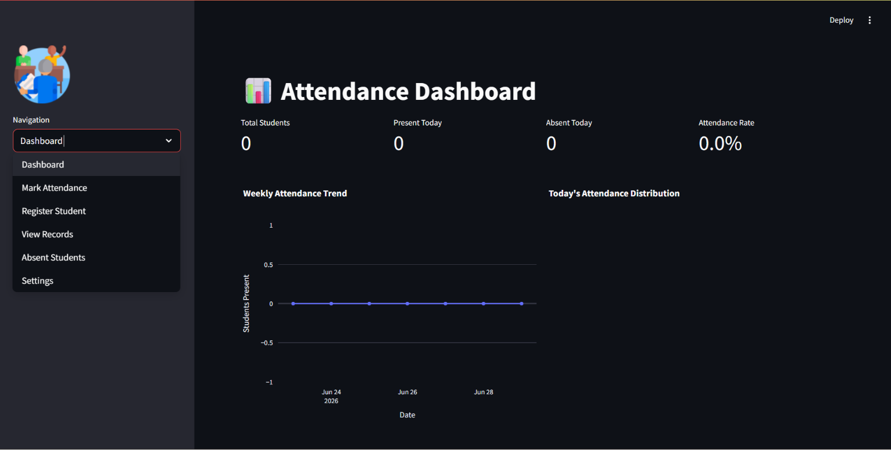
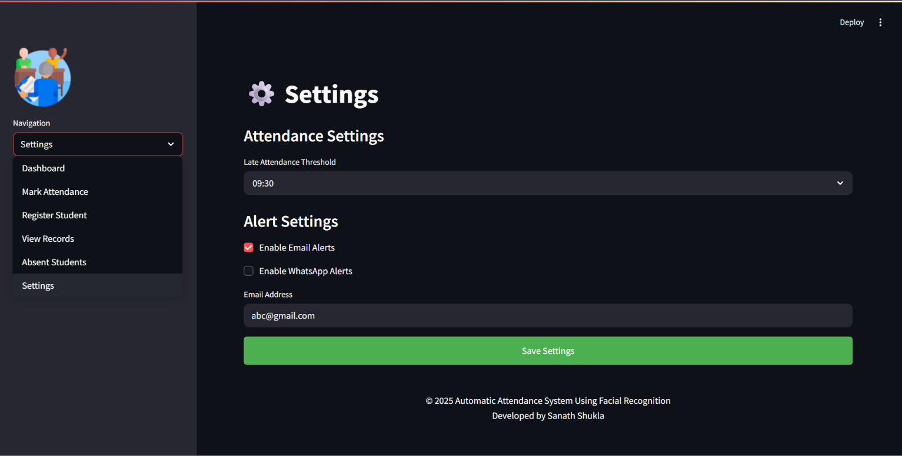

# Smart Attendance System

A Streamlit-based attendance system that uses facial recognition to automate student attendance tracking. The system provides an intuitive web interface for registering students, marking attendance, viewing attendance records, and tracking absent students.

## Features

- **Student Registration**: Register students with their photo taken directly through the web interface
- **Face Recognition**: Real-time face detection and recognition using webcam
- **Attendance Tracking**: Automatic attendance marking with timestamp
- **Attendance Records**: View and download attendance records by date range
- **Absent Students**: View and download list of absent students for any date
- **Settings**: Configure late threshold, email and WhatsApp alert preferences
- **Embedded Camera Interface**: Camera controls integrated directly into the Streamlit UI

## Installation

1. Clone the repository:
    ```bash
    git clone https://github.com/code-dev-007/Smart-Attendance-System.git
    cd Smart-Attendance-System
    ```

2. Create a virtual environment (recommended):
    ```bash
    python -m venv venv
    source venv/bin/activate  # On Windows, use: venv\Scripts\activate
    ```

3. Install system dependencies:
    ```bash
    sudo apt-get install cmake libgl1-mesa-glx
    ```

4. Install the required packages:
    ```bash
    pip install -r requirements.txt
    ```

## Directory Structure

The system will automatically create the following directories:
```
Smart-Attendance-System/
├── app.py                    # Main application file
├── requirements.txt          # Python dependencies
├── packages.txt              # System-level dependencies
├── students.csv              # Student information database
├── settings.csv              # App settings
├── pages/                    # Individual page modules
│   ├── dashboard.py
│   ├── mark_attendance.py
│   ├── register_student.py
│   ├── view_records.py
│   ├── absent_students.py
│   └── settings.py
├── utils/
│   └── system.py             # Core AttendanceSystem class
├── assets/                   # Logo and static files
├── dataset/                  # Stores student photos
├── attendance_records/       # Stores daily attendance CSV files
└── Screenshots/              # App screenshots
```

## Usage

1. Start the application:
    ```bash
    streamlit run app.py
    ```

2. Access the web interface through your browser (typically http://localhost:8501)

3. Use the sidebar menu to navigate between pages:
   - Dashboard
   - Mark Attendance
   - Register Student
   - View Records
   - Absent Students
   - Settings

### Dashboard
1. Select "Dashboard" from the sidebar
2. View today's total, present, and absent student counts
3. View weekly attendance trend and today's distribution charts

### Student Registration
1. Select "Register Student" from the sidebar
2. Enter student Name, Course, Section, Roll No, and Email
3. Take a photo using the embedded camera
4. Click "Register Student" to save

### Mark Attendance
1. Select "Mark Attendance" from the sidebar
2. Select attendance method: **Face Recognition**
3. Click "Start Camera" to begin
4. The system will automatically recognize faces and mark attendance
5. Click "Stop Camera" to stop

### View Attendance
1. Select "View Records" from the sidebar
2. Choose a Start Date and End Date
3. View attendance data in tabular format
4. Download records as CSV if needed

### Absent Students
1. Select "Absent Students" from the sidebar
2. Choose a date
3. Click "Show Absent Students" to view the list
4. Download the absent list as CSV if needed

### Settings
1. Select "Settings" from the sidebar
2. Set the Late Attendance Threshold time
3. Enable/disable Email or WhatsApp alerts
4. Enter notification email or WhatsApp number
5. Click "Save Settings"

## Screenshots

### Dashboard


### Mark Attendance


### Register Student


### View Records


### Absent Students


### Settings


## Dependencies

Major dependencies include:
- Streamlit
- OpenCV
- face_recognition
- NumPy
- Pandas
- Plotly

For a complete list, see `requirements.txt`

## System Requirements

- Python 3.8 or higher
- Webcam for face registration and attendance
- Sufficient RAM for face recognition processing (minimum 4GB recommended)
- CPU with good processing power (for real-time face recognition)

## Limitations

- Works best with good lighting conditions
- Face recognition accuracy may vary based on image quality
- Requires stable internet connection for web interface

## Troubleshooting

1. If the camera doesn't work:
   - Check camera permissions in your browser
   - Ensure no other application is using the camera

2. If face recognition is slow:
   - Reduce the number of registered faces
   - Ensure good lighting conditions
   - Check CPU usage and available memory

3. If `dlib` or `face_recognition` fails to install:
   - Ensure `cmake` is installed on your system
   - Run `sudo apt-get install cmake libgl1-mesa-glx` first

## Contributing

Feel free to submit issues and enhancement requests!

